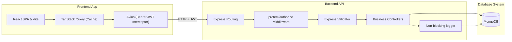
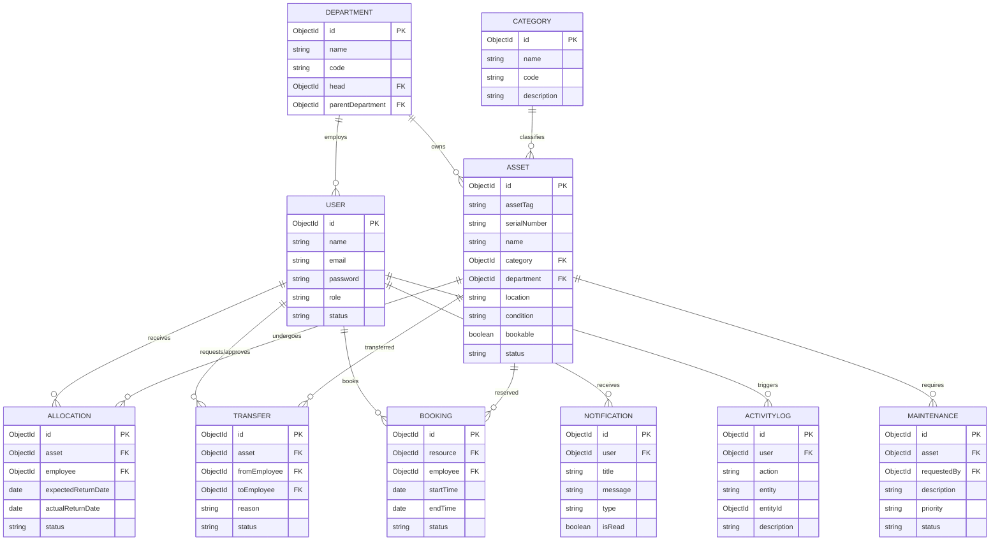
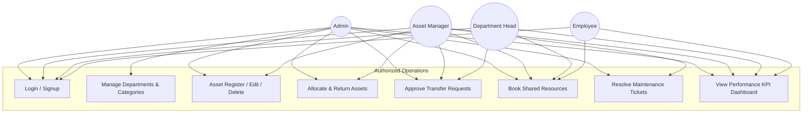
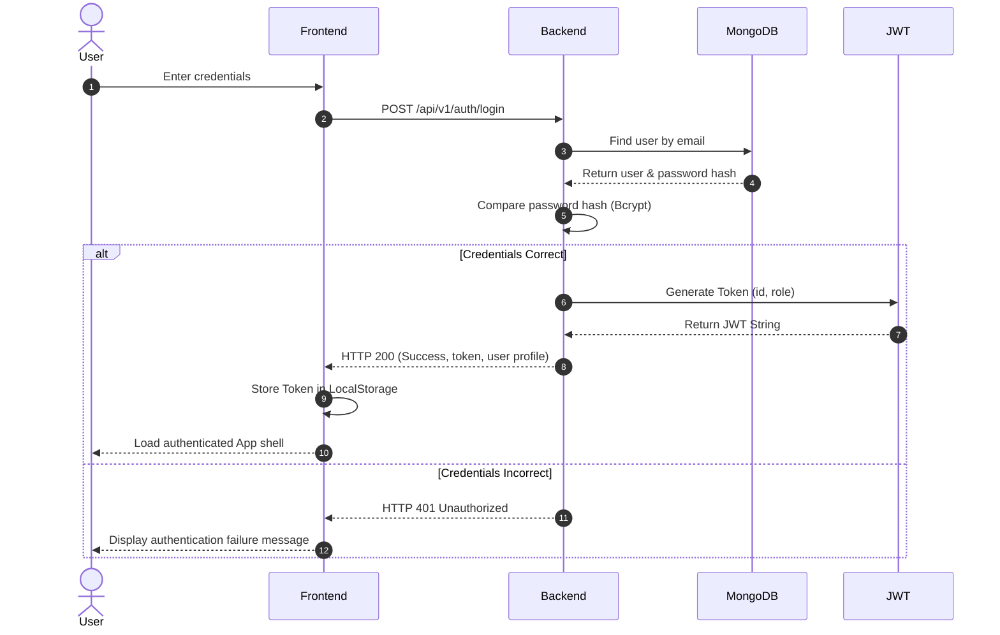
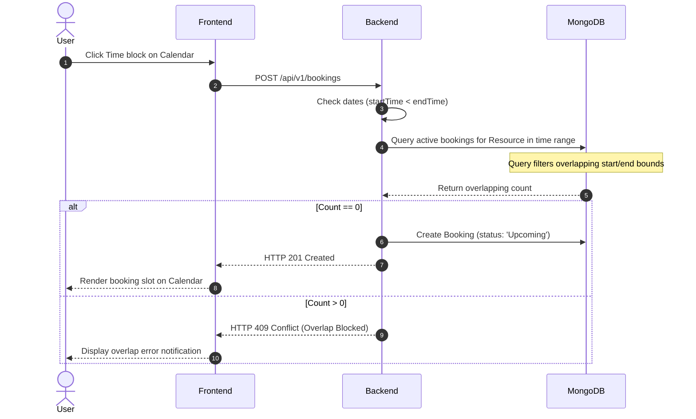
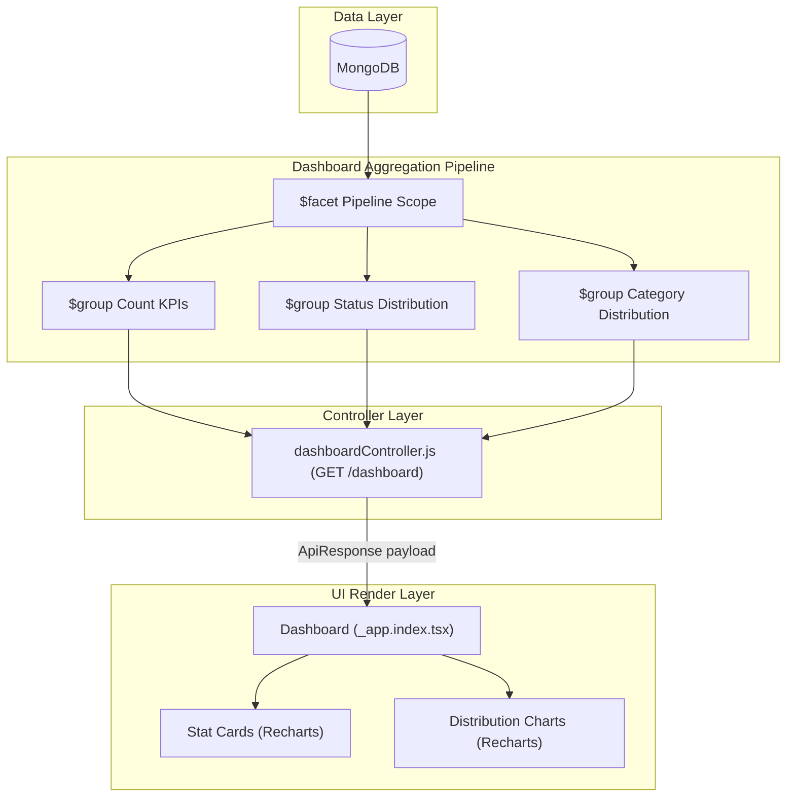

# 🚀 AssetFlow: Enterprise Asset & Resource Management System

[](https://nodejs.org/)
[](https://expressjs.com/)
[](https://www.mongodb.com/)
[](https://react.dev/)
[](https://vitejs.dev/)
[](https://jwt.io/)
[](https://tanstack.com/query)
[](https://odoo.com/)
[](LICENSE)

AssetFlow is a centralized, production-ready ERP system designed to simplify and digitize how modern organizations track, allocate, book, and maintain their physical assets and shared resources. Built with clean architecture, strict role-based access controls (RBAC), robust overlap-validated booking models, and real-time dashboard analytics.

---

## 🗺️ Table of Contents

1. [Project Overview](#-project-overview)
2. [Key Features](#-key-features)
3. [Tech Stack](#-tech-stack)
4. [Architecture & Diagrams](#%EF%B8%8F-architecture--diagrams)
   * [System Architecture](#system-architecture)
   * [Database Schema (ERD)](#database-schema-erd)
   * [Use Case Architecture](#use-case-architecture)
   * [Authentication Flow](#authentication-flow)
   * [Asset Allocation Workflow](#asset-allocation-workflow)
   * [Transfer Request Workflow](#transfer-request-workflow)
   * [Booking Overlap Validation Workflow](#booking-overlap-validation-workflow)
   * [Maintenance Cycle Workflow](#maintenance-cycle-workflow)
   * [Dashboard Aggregation System](#dashboard-aggregation-system)
5. [Directory Layout](#%EF%B8%8F-directory-layout)
6. [API Endpoints Reference](#-api-endpoints-reference)
7. [Role Permissions Matrix](#-role-permissions-matrix)
8. [Screenshots](#-screenshots)
9. [Setup & Installation](#-setup--installation)
10. [Environment Configuration](#-environment-configuration)
11. [Testing Suite](#-testing-suite)
12. [Performance Optimization](#-performance-optimization)
13. [Security Architecture](#-security-architecture)
14. [Future Roadmaps](#-future-roadmaps)
15. [License](#-license)
16. [Acknowledgements](#-acknowledgements)

---

## 📋 Project Overview

### The Problem
Organizations lose significant time and capital managing equipment, furniture, vehicles, and workspaces across scattered spreadsheets, paper logs, and fragmented emails. This leads to double-bookings, untracked asset losses, undocumented handovers, and delayed repairs due to lack of transparent maintenance lifecycles.

### The Solution
AssetFlow provides a centralized ERP directory connecting employees, departments, and physical inventory. It enforces structural lifecycles for every asset, tracks custody changes, manages time-slot reservations for rooms and vehicles, and automates maintenance ticket tracking.

### Who it Helps
* **Admins**: Gain full oversight of departments, category directories, and security logs.
* **Asset Managers**: Register items, allocate hardware, verify handovers, and coordinate repairs.
* **Department Heads**: Approve hardware transfers and coordinate departmental resource usage.
* **Employees**: Browse directory catalogs, check out equipment, schedule rooms, and report malfunctions.

---

## ✨ Key Features

* **Strict Role-Based Access Controls (RBAC)**: Custom middlewares enforce access scopes across standard endpoints (`Admin`, `Asset Manager`, `Department Head`, `Employee`).
* **Active Allocation Hand-overs**: Records hardware conditions at dispatch and return, maintaining a full history of custody.
* **Safe Transfer Workflows**: Restricts direct check-outs of currently assigned assets, instead routing them through automated department-head and manager transfer approval flows.
* **Overlap-Validated Booking Engine**: Fully prevents time-slot conflicts for shared resources via database-level checks.
* **Single-Query Dashboard Aggregation**: Uses MongoDB `$facet` and `$group` aggregations to generate metrics, charts, and recent activity logs in a single db roundtrip.
* **Non-Blocking Logs & Notifications**: Offloads background processes (activity logging, notification alerts) to keep core transaction controllers fast and responsive.

---

## 🛠️ Tech Stack

* **Frontend**: React 18 (TypeScript), Vite, TailwindCSS (Vanilla utility architecture), TanStack Router (Type-safe client routing), TanStack Query (React Query v5 state cache).
* **Backend**: Node.js, Express, Express Validator (Data integrity & sanitization).
* **Database**: MongoDB (Mongoose ODM).
* **Authentication & Security**: JSON Web Tokens (JWT), BCrypt (Password hashing), Helmet, Cross-Origin Resource Sharing (CORS).
* **Visualization**: Recharts (Dynamic Dashboard charting components).

---

## 🗺️ Architecture & Diagrams

### System Architecture


---

### Database Schema (ERD)


---

### Use Case Architecture


---

### Authentication Flow


---

### Asset Allocation Workflow
```mermaid
sequenceDiagram
    autonumber
    actor Manager
    participant Frontend
    participant Backend
    participant MongoDB
    participant LogAlert as Background Logger/Notifier

    Manager->>Frontend: Submit allocation parameters
    Frontend->>Backend: POST /api/v1/allocations
    Backend->>MongoDB: Check current asset status
    MongoDB-->>Backend: Return Asset Document
    alt Asset is 'Available'
        Backend->>MongoDB: Create Allocation (status: 'Active')
        Backend->>MongoDB: Update Asset Status to 'Allocated'
        Backend-.>>LogAlert: Trigger logActivity() & createNotification()
        Backend-->>Frontend: HTTP 201 Created (ApiResponse)
        Frontend-->>Manager: Display success toast notification
    else Asset is Already Allocated
        Backend-->>Frontend: HTTP 409 Conflict
        Frontend-->>Manager: Alert allocation conflict
    end
```

---

### Transfer Request Workflow
```mermaid
sequenceDiagram
    autonumber
    actor Employee
    participant Frontend
    participant Backend
    participant MongoDB
    participant LogAlert as Background Logger/Notifier

    Employee->>Frontend: Select Allocated Asset & input Transfer Target
    Frontend->>Backend: POST /api/v1/transfers
    Backend->>MongoDB: Verify target Employee & Asset status
    MongoDB-->>Backend: Records verified
    Backend->>MongoDB: Create Transfer Request (status: 'Requested')
    Backend-.>>LogAlert: Trigger logActivity() & createNotification()
    Backend-->>Frontend: HTTP 201 Created
    Frontend-->>Employee: Show pending request in timeline

    Note over Frontend,Backend: Approval Cycle (Admin/Manager/Dept Head)
    actor Approver
    Approver->>Frontend: Click Approve transfer
    Frontend->>Backend: PUT /api/v1/transfers/:id/approve
    Backend->>MongoDB: Update Transfer (status: 'Approved')
    Backend->>MongoDB: Close old Allocation (status: 'Returned')
    Backend->>MongoDB: Create new Allocation for target Employee
    Backend->>MongoDB: Update Asset ownership department/employee
    Backend-.>>LogAlert: Trigger background updates
    Backend-->>Frontend: HTTP 200 OK
    Frontend-->>Approver: Refresh lists & update status badges
```

---

### Booking Overlap Validation Workflow


---

### Maintenance Cycle Workflow
```mermaid
sequenceDiagram
    autonumber
    actor User
    participant Frontend
    participant Backend
    participant MongoDB
    participant LogAlert as Background Logger/Notifier

    User->>Frontend: Submit maintenance report
    Frontend->>Backend: POST /api/v1/maintenance
    Backend->>MongoDB: Create request & update Asset status to 'Under Maintenance'
    Backend-.>>LogAlert: Trigger activity log & admin alert
    Backend-->>Frontend: HTTP 201 Created
    Frontend-->>User: Report confirmed & status updated
    
    Note over Frontend,Backend: Resolution Flow
    actor Manager
    Manager->>Frontend: Mark maintenance resolved
    Frontend->>Backend: PUT /api/v1/maintenance/:id/resolve
    Backend->>MongoDB: Update request & set Asset status back to 'Available'
    Backend-.>>LogAlert: Trigger activity log
    Backend-->>Frontend: HTTP 200 OK
    Frontend-->>Manager: Refresh lists
```

---

### Dashboard Aggregation System


---

## 📂 Directory Layout

```
Odoo-Hackathon-Jul2026/
├── backend/
│   ├── src/
│   │   ├── config/             # Database connection & server environment configurations
│   │   ├── constants/          # Application roles ('Admin', 'Asset Manager', etc.) and statuses
│   │   ├── controllers/        # Business logic controllers (auth, asset, allocation, booking, etc.)
│   │   ├── middlewares/        # JWT parsing & Role verification route filters
│   │   ├── models/             # Mongoose Schemas (User, Department, Asset, Booking, etc.)
│   │   ├── routes/             # Express API router definitions
│   │   ├── utils/              # Standard Response & Error helpers, activity logging
│   │   ├── validators/         # Request validation checks using express-validator
│   │   └── server.js           # Express application startup file
│   ├── .env.example            # Backend local environment configurations keys
│   └── package.json            # Node project configuration
└── Frontend/
    ├── src/
    │   ├── components/         # Reusable presentation modules (DataTable, PageHeader, StatusBadge)
    │   │   ├── layout/         # TopNav & Sidebar page layouts
    │   │   └── ui/             # Tailwind UI components (Select, Dialog, Textarea, Inputs)
    │   ├── hooks/              # Custom query hooks (authentication contexts)
    │   ├── lib/                # API client connection configurations
    │   ├── routes/             # TanStack routing page templates
    │   ├── App.css             # Component custom stylesheets
    │   ├── index.css           # Global stylesheet & Tailwind root variable configurations
    │   └── main.jsx            # Frontend bootstrapper
    ├── package.json
    └── vite.config.js          # Vite packager configurations
```

---

## 📡 API Endpoints Reference

### 🔐 Authentication Module
| Method | Route | Purpose | Authorization |
| :--- | :--- | :--- | :--- |
| `POST` | `/api/v1/auth/signup` | Registers new user account (First becomes `Admin`, others default to `Employee`) | Public |
| `POST` | `/api/v1/auth/login` | Authenticates credentials and returns JWT bearer token | Public |
| `GET` | `/api/v1/auth/profile` | Fetches active profile payload | Authorized |
| `PUT` | `/api/v1/auth/promote` | Promotes user role permissions | `Admin` |

### 🏢 Departments Module
| Method | Route | Purpose | Authorization |
| :--- | :--- | :--- | :--- |
| `GET` | `/api/v1/departments` | Lists departments with pagination and search filtering | Authorized |
| `POST` | `/api/v1/departments` | Registers new department | `Admin` |
| `PUT` | `/api/v1/departments/:id` | Modifies department fields | `Admin` |
| `DELETE` | `/api/v1/departments/:id` | Deletes a department | `Admin` |

### 📁 Categories Module
| Method | Route | Purpose | Authorization |
| :--- | :--- | :--- | :--- |
| `GET` | `/api/v1/categories` | Lists asset categories with pagination metadata | Authorized |
| `POST` | `/api/v1/categories` | Creates new category | `Admin`, `Asset Manager` |
| `PUT` | `/api/v1/categories/:id` | Updates category attributes | `Admin`, `Asset Manager` |
| `DELETE` | `/api/v1/categories/:id` | Removes category | `Admin` |

### 👥 Employee Directory
| Method | Route | Purpose | Authorization |
| :--- | :--- | :--- | :--- |
| `GET` | `/api/v1/employees` | Lists employee profiles, roles, and departments | `Admin`, `Asset Manager`, `Department Head` |

### 📦 Assets Module
| Method | Route | Purpose | Authorization |
| :--- | :--- | :--- | :--- |
| `GET` | `/api/v1/assets` | Queries inventory directory with filtering and pagination | Authorized |
| `GET` | `/api/v1/assets/:id` | Fetches asset details, allocation logs, and maintenance logs | Authorized |
| `POST` | `/api/v1/assets` | Registers a new asset | `Admin`, `Asset Manager` |
| `PUT` | `/api/v1/assets/:id` | Modifies asset attributes | `Admin`, `Asset Manager` |
| `DELETE` | `/api/v1/assets/:id` | Removes asset from active catalog (Soft delete) | `Admin` |

### 🤝 Allocation Module
| Method | Route | Purpose | Authorization |
| :--- | :--- | :--- | :--- |
| `GET` | `/api/v1/allocations` | Queries active inventory checkout logs | `Admin`, `Asset Manager` |
| `POST` | `/api/v1/allocations` | Creates check-out record and sets asset to `Allocated` | `Admin`, `Asset Manager` |
| `PUT` | `/api/v1/allocations/:id/return` | Processes asset return and sets asset to `Available` | `Admin`, `Asset Manager` |

### 🔄 Transfer Module
| Method | Route | Purpose | Authorization |
| :--- | :--- | :--- | :--- |
| `GET` | `/api/v1/transfers` | Lists active transfer requests | Authorized |
| `POST` | `/api/v1/transfers` | Submits transfer request for an allocated asset | Authorized |
| `PUT` | `/api/v1/transfers/:id/approve` | Approves transfer request and shifts asset ownership | `Admin`, `Asset Manager`, `Department Head` |
| `PUT` | `/api/v1/transfers/:id/reject` | Rejects transfer request | `Admin`, `Asset Manager`, `Department Head` |

### 📅 Bookings Module
| Method | Route | Purpose | Authorization |
| :--- | :--- | :--- | :--- |
| `GET` | `/api/v1/bookings` | Lists calendar bookings (filtered by day/week) | Authorized |
| `POST` | `/api/v1/bookings` | Creates a booking (requires overlap validation) | Authorized |
| `PUT` | `/api/v1/bookings/:id/cancel` | Cancels a booking | Authorized |

### 🔧 Maintenance Module
| Method | Route | Purpose | Authorization |
| :--- | :--- | :--- | :--- |
| `GET` | `/api/v1/maintenance` | Lists maintenance requests | Authorized |
| `POST` | `/api/v1/maintenance` | Submits a request (sets asset to `Under Maintenance`) | Authorized |
| `PUT` | `/api/v1/maintenance/:id/resolve` | Resolves ticket (sets asset back to `Available`) | `Admin`, `Asset Manager` |

### 📊 Dashboard Module
| Method | Route | Purpose | Authorization |
| :--- | :--- | :--- | :--- |
| `GET` | `/api/v1/dashboard` | Fetches aggregated KPIs, chart datasets, and recent activities | Authorized |

### 📝 Audit & Compliance Module
| Method | Route | Purpose | Authorization |
| :--- | :--- | :--- | :--- |
| `GET` | `/api/v1/activity-logs` | Queries administrative logging feed with filters | Authorized |

### 🔔 Notifications Module
| Method | Route | Purpose | Authorization |
| :--- | :--- | :--- | :--- |
| `GET` | `/api/v1/notifications` | Lists notifications (unread first, then newest first) | Authorized |
| `PUT` | `/api/v1/notifications/:id/read` | Marks notification as read | Authorized |
| `PUT` | `/api/v1/notifications/read-all` | Marks all notifications as read | Authorized |
| `DELETE` | `/api/v1/notifications/:id` | Deletes a notification | Authorized |

---

## 🔐 Role Permissions Matrix

| Operations \ Roles | Admin | Asset Manager | Department Head | Employee |
| :--- | :---: | :---: | :---: | :---: |
| **Manage Users & Promotions** | ✅ | ❌ | ❌ | ❌ |
| **Organization Setup (Depts / Cats)** | ✅ | ⚠️ *Categories Only* | ❌ | ❌ |
| **Register & Edit Assets** | ✅ | ✅ | ❌ | ❌ |
| **Allocate & Return Assets** | ✅ | ✅ | ❌ | ❌ |
| **Request Asset Transfer** | ✅ | ✅ | ✅ | ✅ |
| **Approve Transfer Requests** | ✅ | ✅ | ✅ | ❌ |
| **Raise Maintenance Requests** | ✅ | ✅ | ✅ | ✅ |
| **Resolve Maintenance Requests** | ✅ | ✅ | ❌ | ❌ |
| **Book Resources** | ✅ | ✅ | ✅ | ✅ |
| **View Audit Trail Logs** | ✅ | ✅ | ✅ | ✅ |
| **View General Dashboard** | ✅ | ✅ | ✅ | ✅ |

---

## 📸 Screenshots

* **Main System Dashboard**
  *Placeholder: `assets/dashboard.png`*
* **Asset Directory Management**
  *Placeholder: `assets/assets.png`*
* **Resource Booking Calendar**
  *Placeholder: `assets/bookings.png`*
* **Maintenance Request Center**
  *Placeholder: `assets/maintenance.png`*
* **Reports and Utilization Charts**
  *Placeholder: `assets/reports.png`*

---

## ⚙️ Setup & Installation

### Prerequisites
* **Node.js** v18 or higher installed.
* **MongoDB** server running locally (or connection URI for MongoDB Atlas).

### Clone Repository
```bash
git clone https://github.com/your-repo/Odoo-Hackathon-Jul2026.git
cd Odoo-Hackathon-Jul2026
```

### Backend Setup
1. Navigate to the backend directory:
   ```bash
   cd backend
   ```
2. Install dependencies:
   ```bash
   npm install
   ```
3. Set up your `.env` configuration file (see [Environment Configuration](#-environment-configuration)).
4. Start the backend in development mode:
   ```bash
   npm run dev
   ```

### Frontend Setup
1. Navigate to the frontend directory:
   ```bash
   cd ../Frontend
   ```
2. Install dependencies:
   ```bash
   npm install
   ```
3. Start the frontend application locally:
   ```bash
   npm run dev
   ```
   *The frontend will run at `http://localhost:5174/`.*

---

## ⚙️ Environment Configuration

### Backend `.env` File
Create a `.env` file in the root of the `/backend` folder with the following keys:

| Variable | Description | Example / Default |
| :--- | :--- | :--- |
| `PORT` | Local express backend port | `5000` |
| `MONGODB_URI` | Connection URI string to MongoDB | `mongodb://127.0.0.1:27017/assetflow` |
| `JWT_SECRET` | Secret key used to sign Auth tokens | `superSecretKeyChangeThisInProduction` |
| `JWT_EXPIRES_IN` | Token expiration timeline | `7d` |

### Frontend `.env` File
Create a `.env` file in the root of the `/Frontend` folder:

| Variable | Description | Example / Default |
| :--- | :--- | :--- |
| `VITE_API_BASE_URL` | Base API endpoint path pointing to backend | `http://localhost:5000/api/v1` |

---

## 🧪 Testing Suite

AssetFlow uses an end-to-end regression validation pipeline to test and verify code correctness:
* **Authentication Validation**: Validates registration workflows, password requirements, and JWT extraction.
* **RBAC Controls**: Confirms that non-Admin roles are blocked from administrative routes and operations (both in UI components and backend middleware API filters).
* **Database & Validation Integrity**: Tests that standard forms (like Register Asset) validate inputs, reject empty fields, and handle string normalization (such as mapping `"none"` inputs to Mongoose `null` for relational models).
* **Asset Allocation & Custody Handovers**: Validates checkouts, returns, and automatic status updates.
* **Overlap Check Validation**: Validates resource bookings and blocks overlapping reservations.
* **Maintenance Cycle Handovers**: Verifies that raising maintenance requests sets asset status to `Under Maintenance`, and resolving them returns it to `Available`.

---

## ⚡ Performance Optimization

* **MongoDB Aggregations ($facet)**: The API avoids multiple separate count queries (e.g. `countDocuments()`). Instead, it processes KPI metrics, status distributions, category allocations, and history logs in a single query pipeline, reducing database latency.
* **Non-Blocking Background Tasks**: Offloads creation of activity logs and compliance notifications (using catch-handling fire-and-forget models) so that primary business routes resolve immediately without waiting for background logs to write.
* **TanStack Query Caching**: Implements structured, suffixed cache keys (`["assets-allocation-list"]`, `["categories-all-list"]`) to isolate queries and prevent page-level cache collisions.
* **Axios Interceptors**: Integrates centralized error handling to intercept network requests, parse response payloads, and inject Auth Bearer tokens transparently.

---

## 🛡️ Security Architecture

* **JSON Web Tokens**: Cryptographically signs authentication tokens, verifying authorization on every protected route.
* **Password Hashing**: Uses **Bcrypt** with salt rounds to secure passwords before writing them to the database.
* **Server Request Validation**: Uses **Express Validator** schemas to sanitize user inputs, checking ObjectIDs and dates before they reach database transactions.
* **Header Protection & CORS Rules**: Integrates standard request headers and defines origin permissions to prevent cross-site scripting (XSS) and unauthorized cross-origin requests.

---

## 🔮 Future Roadmaps

* **QR Code Tracking**: Print custom QR asset labels directly from the asset page, allowing mobile scanners to quickly view asset info.
* **Barcode Integration**: Integrated inventory scans to speed up bulk checkouts and handovers.
* **Automated Email Notifications**: Schedule email reminders for expected returns or upcoming resource bookings.
* **Cloud Document Storage**: Upload purchase receipts, manuals, and repair documentation directly to AWS S3.

---

## 📄 License

Distributed under the MIT License. See [LICENSE](LICENSE) for more information.

---

## 🤝 Acknowledgements

* [Odoo Hackathon 2026](https://odoo.com/) for the design prompts and baseline challenges.
* The open-source communities behind Express, React, TailwindCSS, and Mongoose.
